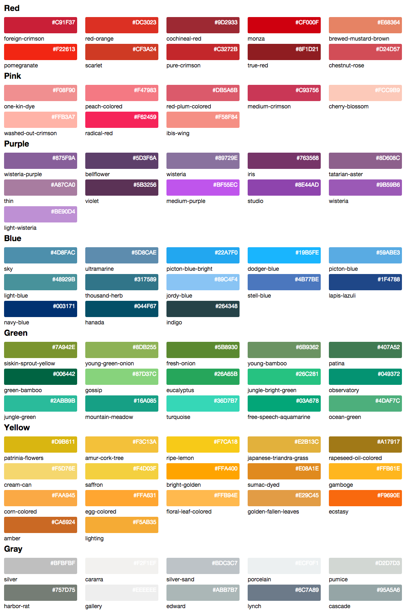

# Bootflat Color Picker Colors

The package helps you to use colors from [Bootflat Color Picker](http://bootflat.github.io/color-picker.html) by importing them to your SASS file. 

The colors have simple names and are very easy to use. Download from Github or use Bower.

## Installing via Bower

```
bower install bootflat-color-picker-colors
```

That's it! 

Now import the color files to your SASS file and start using! 

---

